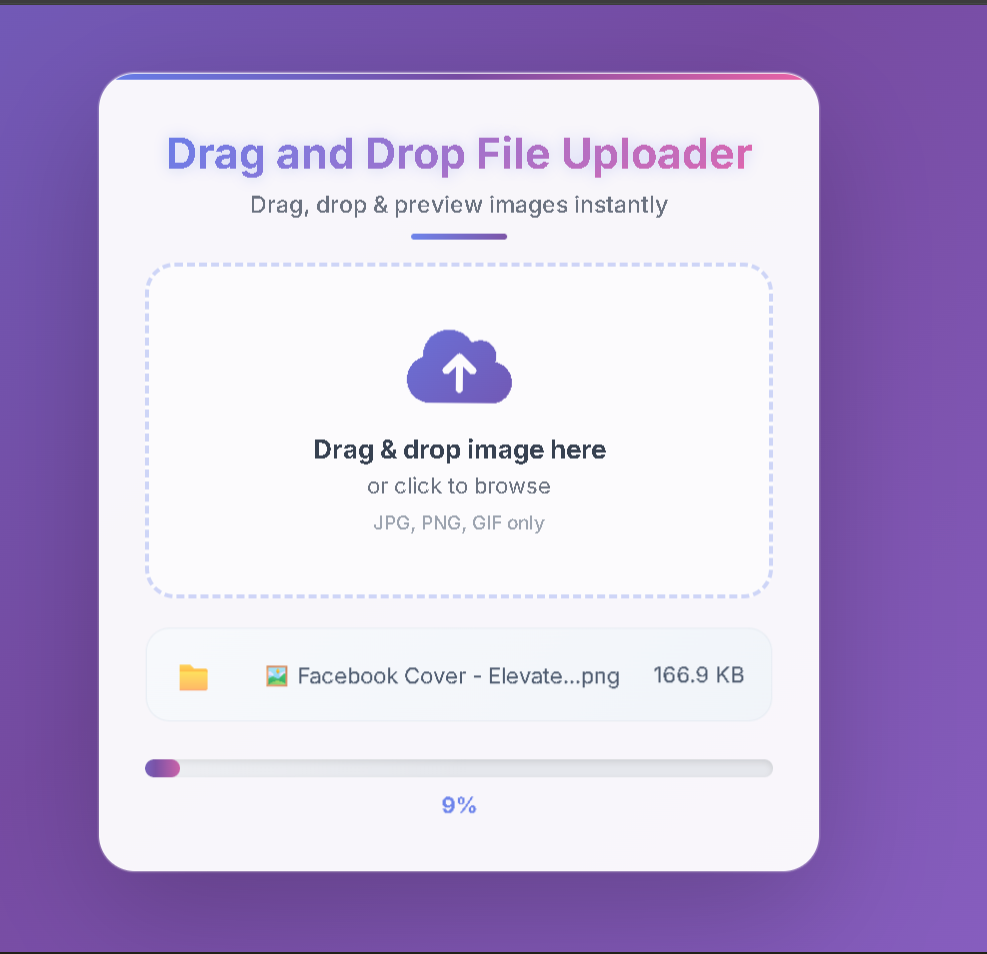
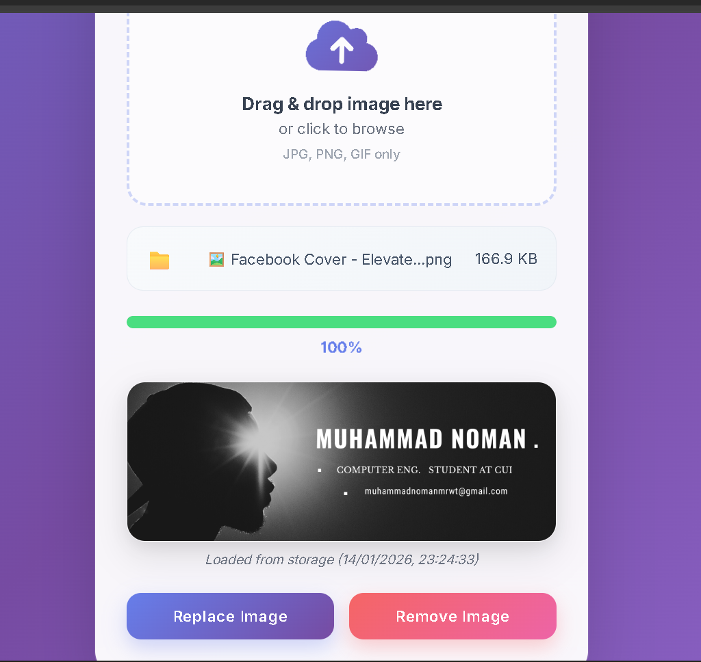

#  Drag & Drop File Uploader (With Preview & Progress Bar)

A modern, animated drag-and-drop file uploader built with HTML, CSS, and JavaScript. Features a premium UI with smooth animations, instant image preview, and localStorage persistence.


# Features

-  Premium UI/UX

   Glassmorphism design with animated gradients
   Smooth micro-interactions & hover effects
   Particle animations on drag
   Responsive design for all devices

-Drag & Drop Functionality

   Intuitive drag-and-drop interface
   Visual feedback during drag operations
   Click-to-browse alternative
   File type validation (JPG, PNG, GIF)

-Real-time Feedback

  Animated progress bar with shimmer effect
  File info display with size formatting
  Instant image preview with pop-in animation
  Success/error notifications with animations

- Advanced Features
   LocalStorage persistence (images survive page refresh)
   Max file size validation (5MB)
   Keyboard shortcuts (ESC to remove, Ctrl+R to replace)
   Upload timestamp tracking

# Live Demo

🔗 [View Live Demo](https://nominewgit-hub.github.io/Drag-Drop-File-Uploader/)

# Screenshots

| Drag & Drop Interface | Upload Progress | Image Preview |


|  

|  

|  


# Technologies Used

*HTML5* 
 - Semantic markup
*CSS3*
 - Advanced animations, gradients, flexbox
*JavaScript (ES6)* 
 - DOM manipulation, File API, localStorage
*Font Awesome* 
 - Icon library
*Google Fonts* 
 - Inter font family

# Project Structure
drag-drop-uploader/
├── index.html # Main HTML file
├── style.css # Styling with animations
├── script.js # JavaScript functionality
├── README.md # This documentation
└── screenshots/ # Project screenshots


# Installation & Usage

1. *Clone the repository*

   ```bash
   git clone https://github.com/yourusername/drag-drop-uploader.git


2. *Navigate to project directory*

 cd drag-drop-uploader

# Open in browser
 Simply open index.html in any modern browser
 No build process or dependencies required!


# Key Concepts Learned
 HTML5
 File input API with accept attribute
 Semantic HTML structure

# CSS3
 Advanced animations using @keyframes
 Glassmorphism effects with backdrop-filter
 Gradient backgrounds and text
 Responsive design principles

# JavaScript
 Drag-and-drop events (dragover, drop, dragleave)
 FileReader API for image preview
 localStorage for data persistence
 Event delegation and DOM manipulation
 Progress simulation with setTimeout

# Animation Highlights
 Floating icon animation in drop zone
 Shimmer effect on progress bar
 Pop-in animation for image preview
 Particle effects during drag
 Success checkmark animation
 Smooth transitions for all interactions

# Browser Compatibility
 Chrome 90+
 Firefox 88+ 
 Safari 14+ 
 Edge 90+

# 🤝 Contributing
 Contributions are welcome! Please feel free to submit a Pull Request.

    Fork the project
    Create your feature branch (git checkout -b feature/AmazingFeature)
    Commit your changes (git commit -m 'Add some AmazingFeature')
    Push to the branch (git push origin feature/AmazingFeature)
    Open a Pull Request

# License
 This project is licensed  are free ......

# Acknowledgments
    Internee.pk for the virtual internship opportunity

 Font Awesome for icons
 Google Fonts for Inter font
 All open-source libraries and resources used

## 👨‍💻 Author
# Muhammad Noman
# GitHub: https://github.com/nominewgit-hub

# LinkedIn: https://www.linkedin.com/in/muhammad-noman-638934335/

